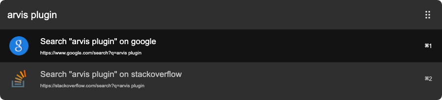
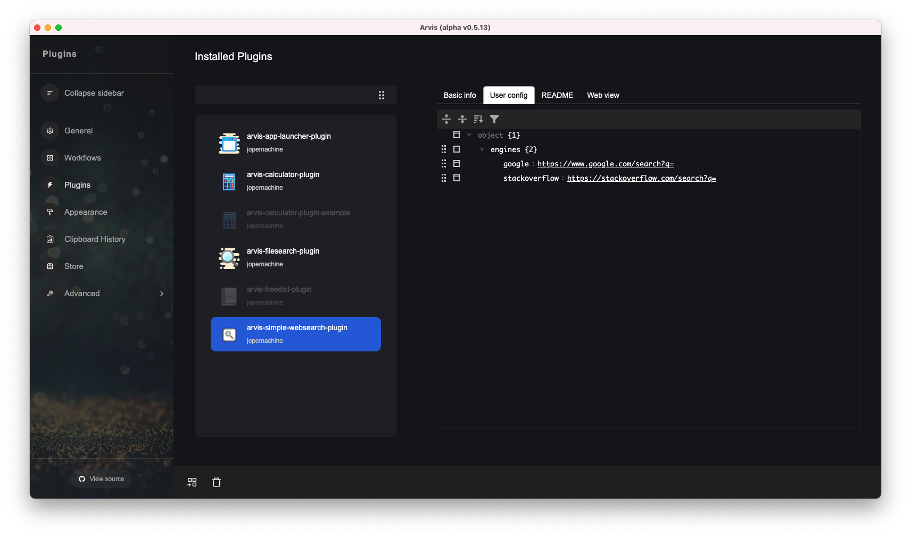

# arvis-simple-websearch-plugin

Simple web search plugin for Arvis.

## Usage

Add more web search engine you want to below config table.

## Related

- [arvish](https://github.com/jopemachine/arvish) - Arvis workflow, plugin creator tools

- [available plugins](https://github.com/jopemachine/arvis/blob/master/documents/plugin-links.md)
